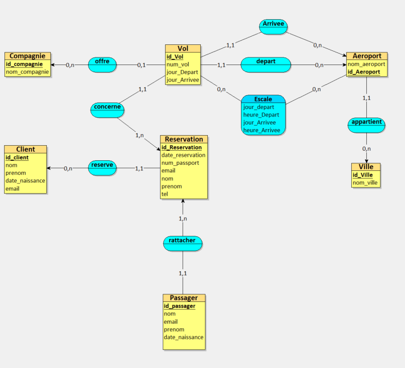
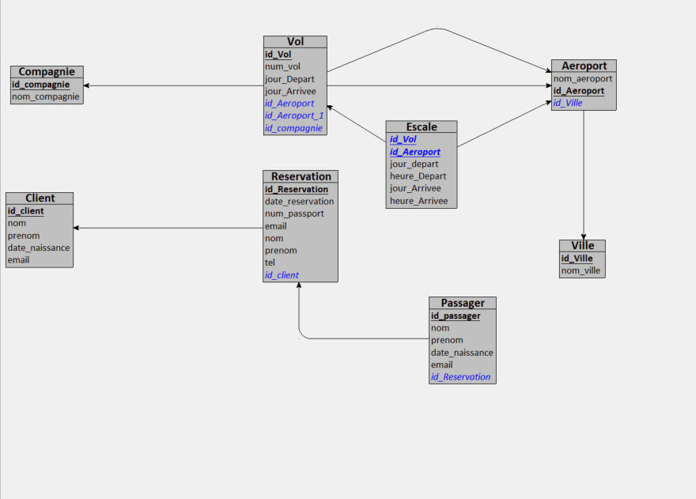
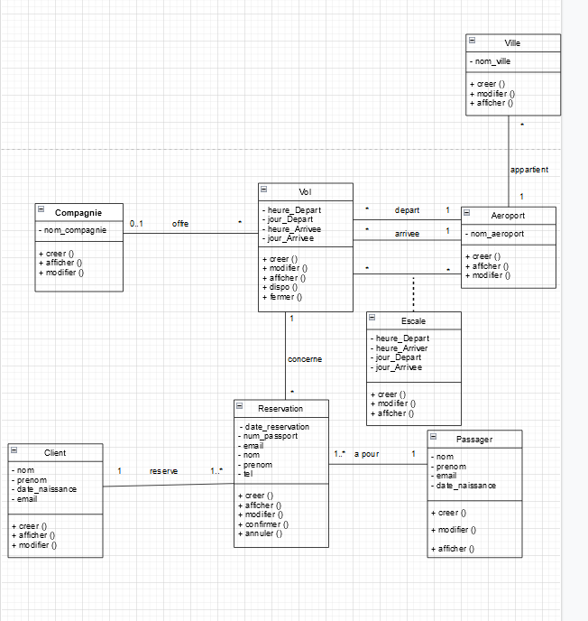

<h1>Merise-MCD-MLD-MPD</h1>

----

<h3>Contexte du projet</h3>

Votre client, une agence de voyages, souhaite proposer la possibilité de réserver en ligne des billets d'avion à leurs clients.
Votre mission est de concevoir à l'aide du standard UML la modélisation de la plateforme.
La plateforme devra permettre que :

* Un vol est ouvert à la réservation et refermé sur ordre de la compagnie.
* Un vol peut être annulé par la compagnie
* Un client peut réserver un ou plusieurs vols, pour des passagers différents.
* Une réservation concerne un seul vol et un seul passager.
* Une réservation peut être annulée ou confirmée.
* Un vol a un aéroport de départ et un aéroport d’arrivée.
* Un vol a un jour et une heure de départ, et un jour et une heure d’arrivée.
* Un vol peut comporter des escales dans des aéroports.
* Une escale a une heure d’arrivée et une heure de départ.
* Chaque aéroport dessert une ou plusieurs villes.
* Des compagnies aériennes proposent différents vols.

<h3>Modalités pédagogiques</h3>

Travail en individuel. Livraison pour Mardi 20 Septembre 2022 09h00.

<h3>Critères de performance</h3>
Un readme répertoriant les informations principales.
Tous les diagrammes doivent correspondre à la notation officielle du standard UML et Merise
Les diagrammes doivent être exportés en format images facilement consultables (jpeg, png).
Minimum d'un commit par diagramme.

La conception Merise doit respecter au minimum les 3 premières formes normales.

<h3>Modalités d'évaluation</h3>
Correction en groupe et revue des diagrammes sur Github

<h3>Livrables</h3>
Dans un dépôt Github : 
Pour la base de données :

* Un MCD
* Un MLD
* Un MPD

Pour l'application :
* Un dictionnaire de données
* Des règles de gestion
* Un diagramme de cas d'utilisation
* Un diagramme de classe
* Un diagramme de Séquence

<h1>Merise</h1>

<h2>Régle de gestion</h2>

<h3>RESERVATION </h3>

* un n° de passport
* une date de reservation
* un nom
* prenom
* un email de contact
* un numero de telephone
* peut être annuler par le client 
* peut être modifier par le client
* peut être afficher par le client
* une reservation peu appartenir a plusieur personne  et plusieur vol

<h3>VOL </h3>

* un numero de vol  
* un aeroport de depart avec une date de depart et une heure depart 
* un aeroport d'arrive avec une date d'arrivvee et une heure d'arrivee  
* vol avec un ou plusieur passager  
* un vol ne peux pas être reservable ou non  
* un vol peut faire des escale dans un AEROPORT  
* le vol est un trajet d'un aeroport à un autre  

<h3>AEROPORT</h3>

* un aeroport se trouve dans une ville  
* un aeroport a un nom

<h3>VILLE</h3>

* un nom

<h3>COMPAGNIE</h3>

* A un nom
* peut avoir un ou plusieur vol

<h3>ESCALE</h3>

* une date et une heure d'arrivée
* une date et une heure de depart
* un aeroport de depart
* un aeroport d'arrivee

<h2>Dictionnaire de données</h2>


[](https://github.com/Habaya76/keke_voyage/blob/main/MCD.png)]

<h2>MCD</h2>

*Modèle Conceptuel de données*

[](https://github.com/Habaya76/keke_voyage/blob/main/MCD.png)]

<h2>MLD</h2>

*Modèle Logique de données*

[](https://github.com/Habaya76/keke_voyage/blob/main/MLD.png)]

<h2>MPD</h2>

*Modèle Physique de données*

<h3>Script SQL</h3>

```sql
CREATE TABLE Compagnie(
   id_compagnie INT,
   nom_compagnie VARCHAR(255),
   PRIMARY KEY(id_compagnie)
);

CREATE TABLE Client(
   id_client INT,
   nom VARCHAR(255),
   prenom VARCHAR(255),
   date_naissance DATE,
   email VARCHAR(255),
   PRIMARY KEY(id_client)
);

CREATE TABLE Ville(
   id_Ville INT,
   nom_ville VARCHAR(50),
   PRIMARY KEY(id_Ville)
);

CREATE TABLE Reservation(
   id_Reservation INT,
   date_reservation DATETIME,
   num_passport VARCHAR(255),
   email VARCHAR(255),
   nom VARCHAR(255),
   prenom VARCHAR(255),
   tel VARCHAR(255),
   id_client INT NOT NULL,
   PRIMARY KEY(id_Reservation),
   FOREIGN KEY(id_client) REFERENCES Client(id_client)
);

CREATE TABLE Aeroport(
   id_Aeroport INT,
   nom_aeroport VARCHAR(255),
   id_Ville INT NOT NULL,
   PRIMARY KEY(id_Aeroport),
   FOREIGN KEY(id_Ville) REFERENCES Ville(id_Ville)
);

CREATE TABLE Passager(
   id_passager INT,
   nom VARCHAR(255),
   email VARCHAR(255),
   prenom VARCHAR(255),
   date_naissance VARCHAR(255),
   id_Reservation INT NOT NULL,
   PRIMARY KEY(id_passager),
   FOREIGN KEY(id_Reservation) REFERENCES Reservation(id_Reservation)
);

CREATE TABLE Vol(
   id_Vol INT,
   num_vol VARCHAR(255),
   jour_Depart DATETIME,
   jour_Arrivee DATETIME,
   id_Reservation INT NOT NULL,
   id_Aeroport INT NOT NULL,
   id_Aeroport_1 INT NOT NULL,
   id_compagnie INT,
   PRIMARY KEY(id_Vol),
   FOREIGN KEY(id_Reservation) REFERENCES Reservation(id_Reservation),
   FOREIGN KEY(id_Aeroport) REFERENCES Aeroport(id_Aeroport),
   FOREIGN KEY(id_Aeroport_1) REFERENCES Aeroport(id_Aeroport),
   FOREIGN KEY(id_compagnie) REFERENCES Compagnie(id_compagnie)
);

CREATE TABLE Escale(
   id_Vol INT,
   id_Aeroport INT,
   jour_depart DATE,
   heure_Depart TIME,
   jour_Arrivee DATE,
   heure_Arrivee TIME,
   PRIMARY KEY(id_Vol, id_Aeroport),
   FOREIGN KEY(id_Vol) REFERENCES Vol(id_Vol),
   FOREIGN KEY(id_Aeroport) REFERENCES Aeroport(id_Aeroport)
);

 ```
<h2>Diagramme de classe</h2>


[](https://github.com/Habaya76/keke_voyage/blob/main/Diagramme_classe.png)]
